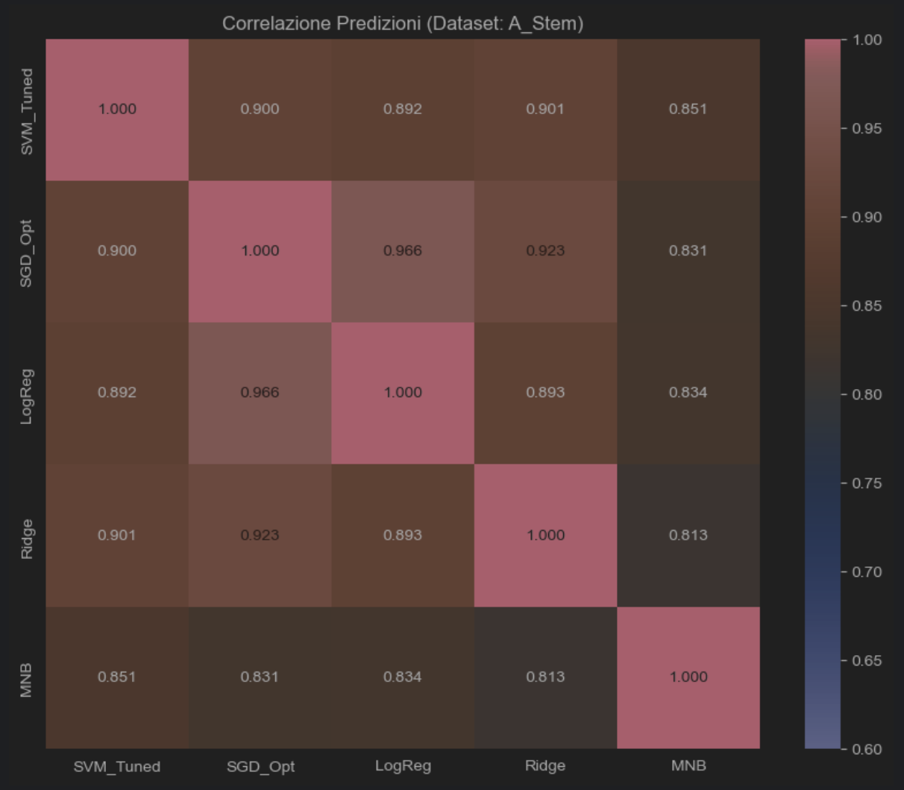
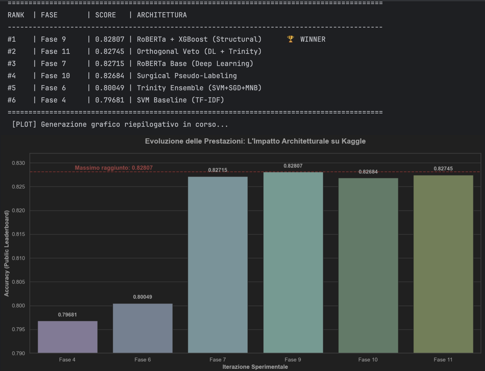

# Disaster Tweet Classification using Machine Learning, Transformers and Ensemble Learning



A complete Natural Language Processing (NLP) pipeline for identifying real disaster-related tweets using Machine Learning, Transformer architectures and ensemble learning techniques.

The project was developed for the Kaggle competition **Natural Language Processing with Disaster Tweets** and explores multiple approaches ranging from classical NLP models to advanced Transformer-based architectures.

---

## Kaggle Competition

Competition:

https://www.kaggle.com/competitions/nlp-getting-started

Objective:

Determine whether a tweet refers to a real disaster event or uses disaster-related terminology in a metaphorical or non-emergency context.

Examples:

**Real Disaster**

```text
Forest fire near La Ronge Sask. Canada
```

**Non-Disaster**

```text
My exams are a complete disaster.
```

This task requires contextual language understanding rather than simple keyword matching.

---

## Final Result



### Best Public Leaderboard Score

```text
0.82807
```

The final score was achieved through a hybrid ensemble strategy combining Transformer models and traditional Machine Learning approaches.

---

## Project Overview

The project follows a progressive experimentation framework consisting of:

1. Exploratory Data Analysis
2. Advanced Text Preprocessing
3. MinHash-based Deduplication
4. Classical Machine Learning Benchmarking
5. Hyperparameter Optimization
6. Ensemble Learning
7. Transformer Fine-Tuning (RoBERTa)
8. Structural Error Correction
9. CatBoost Hybrid Modeling
10. Pseudo Labeling
11. Final Ensemble Construction

The objective was not only to maximize leaderboard performance but also to understand the strengths and weaknesses of different NLP paradigms.

---

## Dataset

Source:

- Kaggle NLP Getting Started Dataset

Dataset Characteristics:

- 7,613 labeled training tweets
- 3,263 unlabeled test tweets
- Binary classification task

Target labels:

| Label | Meaning |
|---------|---------|
| 1 | Real Disaster |
| 0 | Non-Disaster |

Additional metadata:

- Tweet text
- Keyword
- Location

---

## Exploratory Data Analysis

The first phase focused on understanding the structure of the dataset.

Performed analyses included:

- Tweet length distribution
- Word count analysis
- Class balance verification
- Keyword frequency analysis
- N-gram exploration
- Vocabulary inspection

Key finding:

Real disaster tweets tend to be longer, more descriptive and more informative than non-disaster tweets.

---

## Advanced Text Preprocessing

Two preprocessing pipelines were developed and compared.

### Conservative Pipeline

- URL removal
- HTML cleaning
- Lemmatization
- Standard stop-word removal

### Aggressive Pipeline

- Vocabulary reduction
- Noise filtering
- Custom stop-word handling
- Length filtering

Additionally, keyword information was injected into tweet text to enrich contextual information.

---

## Duplicate Detection using MinHash

A MinHash Locality Sensitive Hashing approach was implemented to detect:

- Exact duplicates
- Near duplicates
- Label inconsistencies

Benefits:

- Reduction of label noise
- Improved dataset quality
- More reliable model evaluation

---

## Classical Machine Learning Models

Several traditional NLP classifiers were evaluated.

### Models Tested

- Support Vector Machine (SVM)
- Logistic Regression
- SGD Classifier
- Ridge Classifier
- Multinomial Naive Bayes

### Feature Extraction

- TF-IDF
- Unigrams
- Bigrams
- Trigrams

Best classical model:

```text
SVM + TF-IDF Bigrams
```

---

## Hyperparameter Optimization

Extensive tuning was performed on the best-performing SVM model.

Optimized parameters included:

- Regularization coefficient
- Class weights
- N-gram configurations
- Feature selection settings

The objective was to maximize disaster recall while minimizing false negatives.

---

## Ensemble Learning

Multiple Machine Learning models were combined through weighted voting.

Ensemble members:

- SVM
- SGD Classifier
- Multinomial Naive Bayes

This approach improved robustness and reduced model variance.

---

## Transformer Fine-Tuning

The project transitioned from classical NLP approaches to Transformer architectures.

### Model

- RoBERTa Base

### Experiments

Two configurations were evaluated:

- RAW Tweets
- CLEAN Tweets

Training setup:

- Learning Rate: 2e-5
- 3 Epochs
- Mixed Precision Training (FP16)
- Hugging Face Transformers

Results showed that RoBERTa significantly outperformed all traditional models.

---

## Structural Error Correction with XGBoost

An auxiliary XGBoost model was developed to capture structural tweet characteristics.

Features included:

- Character count
- Word count
- Uppercase ratio
- URL presence
- Punctuation patterns
- Special character frequency

This model acted as a corrective layer on top of RoBERTa predictions.

---

## Hybrid Modeling with CatBoost

A hybrid feature space was constructed by combining:

### Semantic Features

- TF-IDF representations
- Cleaned tweet text

### Structural Features

- Tweet metadata
- Linguistic characteristics

Model:

```text
CatBoost
```

The resulting model demonstrated strong performance and complementary behavior with respect to RoBERTa.

---

## Pseudo Labeling

A self-training strategy was implemented.

Workflow:

1. Generate predictions on the test set
2. Select high-confidence samples
3. Use predictions as pseudo-labels
4. Retrain the model on the augmented dataset

This technique improved robustness and helped exploit unlabeled information.

---

## Final Ensemble

The final solution combined:

- RoBERTa
- XGBoost Structural Correction
- CatBoost Hybrid Model

Weighted majority voting was used to generate final predictions.

This ensemble achieved the best competition performance.

---

## Technologies

### Programming

- Python

### NLP

- NLTK
- Hugging Face Transformers

### Machine Learning

- Scikit-Learn
- XGBoost
- CatBoost

### Deep Learning

- PyTorch
- RoBERTa

### Data Processing

- Pandas
- NumPy

### Visualization

- Matplotlib
- Seaborn

### Additional Techniques

- MinHash
- Locality Sensitive Hashing (LSH)
- Pseudo Labeling
- Ensemble Learning

---

## Repository Structure

```text
.
├── README.md
│
├── notebooks/
│   └── disaster_tweets_complete_pipeline.ipynb
│
├── figures/
│   ├── model_comparison.png
│   └── leaderboard_score.png
│
└── requirements.txt
```

---

## Key Contributions

- Advanced NLP preprocessing pipeline
- MinHash-based duplicate detection
- Benchmarking of multiple ML algorithms
- Transformer fine-tuning with RoBERTa
- XGBoost-based structural correction
- CatBoost hybrid modeling
- Pseudo-labeling strategy
- Multi-model ensemble learning
- Kaggle competition participation

---

## Academic Context

This project was developed within the **Massive Data Mining** course of the M.Sc. in Data Science and Innovation Management at the University of Salerno.

The objective was to design, evaluate and optimize multiple Natural Language Processing approaches for real-world disaster detection from social media streams.

---

## Author

**Giuseppe Rega**

University of Salerno

M.Sc. in Data Science and Innovation Management